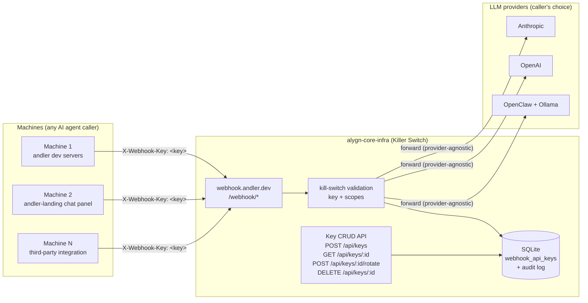

# ADR-019: Machine API-Key Contract (LLM-Agnostic)

## Status

**Proposed** — 2026-08-07

## Date

2026-08-07

## Author

Hugrukal 📐 (Architect)

## Deciders

Andler, Keridz ⚙️ (BE), Wobblus (orchestrator)

## Depends on

- ADR-018 (live-chat webhook auth pattern — one caller's contract)
- ADR-017 (historical Tailscale chat transport framing)
- `alygn-core-infra` PRs #42–#46 (kill-switch + API-key surface)

---

## 1. Context

The ALYGN core infrastructure (`Intention-Alliance/alygn-core-infra`,
the **Killer Switch**) is the production surface for machine access
control. Per Andler-direct 2026-08-07 02:48 CST:

> "The align core infra doesn't need a live chat route, it needs an API
> key management. This key management is to allow the machine access
> thus, it is the AI which is presented as machine (general name),
> where each machine handles their own access key and agnostic webhook
> connection with LLMs, such as OpenClaw with Ollama providers (what
> OpenClaw has configured... Must be agnostic)."

Three forces drive this decision:

1. **LLM provider explosion.** OpenClaw + Ollama is one configuration;
   OpenAI, Anthropic, and future providers are equally valid callers.
   The backend must not couple to any single provider.
2. **Machine-scoped access.** Each AI agent caller ("machine") needs
   its own access key so the kill-switch can answer "which key sees
   what, and how many keys see them" — per machine, not per user.
3. **Scope creep risk.** PR #50 on `alygn-core-infra`
   (`fix(webhook): register /webhook/live-chat handler`) adds 3694
   lines including `live-chat-bridge`, `meet-notes-bridge`, and
   `openclaw-api-handler` skills. The key-management surface portion
   may be valid; the chat-route handler is not the kill-switch's
   concern. This ADR locks the boundary.

## 2. Decision

### 2.1 The machine abstraction

- A **machine** is any AI agent caller: andler's dev servers,
  andler-landing's chat panel, future internal tools, third-party
  integrations.
- Each machine has **exactly one access key** (rotatable).
- Keys are managed by `alygn-core-infra` (the Killer Switch) — the
  backend admin system that controls key assignment per machine.

### 2.2 The LLM-agnostic contract

- The webhook accepts **any LLM provider configuration that OpenClaw
  can carry**. OpenClaw + Ollama is one such configuration.
- The webhook **MUST NOT couple to a specific LLM provider**. Provider
  choice is the caller's concern, not the backend's.
- The backend's only job: validate the machine key, enforce scopes,
  and forward the request to the caller's configured provider.

### 2.3 The key-management surface

`alygn-core-infra` exposes CRUD endpoints for keys:

- `POST /api/keys` — create (admin-only)
- `GET /api/keys/:id` — read metadata (key value never returned
  post-creation)
- `POST /api/keys/:id/rotate` — generate new value, mark old as
  grace-period
- `DELETE /api/keys/:id` — revoke

Keys are **machine-scoped** (not user-scoped). Each key has:

| Field | Type | Notes |
|---|---|---|
| `id` | ulid | stable identifier |
| `machine_id` | text | owning machine (see §6 delta) |
| `hashed_value` | sha256 hex | plaintext never stored |
| `scopes` | csv | e.g. `live-chat,blog-pipeline,webhook-request` |
| `created_at` | timestamp | |
| `rotated_at` | timestamp | nullable |
| `revoked_at` | timestamp | nullable |

### 2.4 The caller pattern

- Every caller (machine) sends `X-Webhook-Key: <key>` header (or
  `Authorization: Bearer` for the JWT path during migration).
- The caller is identified **by key, not by IP or hostname**.
- The caller configures its own LLM provider (OpenClaw, Ollama, or any
  other the caller integrates with).

## 3. Architecture



## 4. Caller pattern

### 4.1 Header

```http
POST /webhook/live-chat HTTP/1.1
Host: webhook.andler.dev
X-Webhook-Key: <machine_key>
Content-Type: application/json
```

### 4.2 Provider independence

The caller's LLM provider is its own concern. The webhook validates
the key, checks scopes, and forwards — it never inspects or constrains
which provider the caller uses. OpenClaw + Ollama, OpenAI, Anthropic,
or any future provider are all valid behind the same key contract.

### 4.3 Migration note

During migration, `Authorization: Bearer <jwt>` (EdDSA-signed) remains
accepted for Tailscale-internal callers that hold keypairs (ADR-018
§2.1). The `X-Webhook-Key` path is the target end-state for all
machines.

## 5. Key-management surface

| Endpoint | Method | Auth | Behavior |
|---|---|---|---|
| `/api/keys` | POST | admin | create key; returns plaintext **once** |
| `/api/keys/:id` | GET | admin | metadata only; hash never returned |
| `/api/keys/:id/rotate` | POST | admin | new value returned once; old enters grace period |
| `/api/keys/:id` | DELETE | admin | soft delete (`revoked_at` set) |

Existing implementation (PRs #42–#46) already provides the v1 surface
at `/v1/admin/api-keys` with `webhookApiKeys` + `webhookApiKeyAudit`
tables. This ADR canonicalizes the contract and names the machine
abstraction.

## 6. Delta vs current implementation

The current `webhookApiKeys` schema (PR #42) has `name` as a human
label but **no `machine_id` column**. To honor the machine abstraction:

- Add `machine_id` (nullable for legacy keys, required for new keys).
- Key rotation should preserve `machine_id` and record `rotated_at`.
- Scopes should be validated against the machine's registered scopes.

This is a schema evolution, not a rewrite — the audit log and
hashing service carry over unchanged.

## 7. Cross-references

- **ADR-017** (`docs/architecture/ADRs/ADR-017-ollama-tailscale-chat-transport.md`)
  — historical Tailscale framing; superseded for auth purposes by
  ADR-018 + this ADR.
- **ADR-018** (`andler-landing` → `docs/adr/ADR-018-live-chat-webhook-auth.md`)
  — the live-chat caller's auth header pattern; one of N machine
  callers.
- **`alygn-core-infra` PRs #42–#46** — kill-switch + API-key surface
  (DB-backed key management, trusted origins, placeholder-secret guard,
  port hardening).
- **PR #50** — scope-creep marker: live-chat handler registration does
  not belong in the kill-switch repo beyond the key-management surface.

## 8. Consequences

**Positive:**

- Future-proofs against LLM provider changes — the backend never
  couples to a provider.
- Decouples the kill-switch from any specific chat product.
- Enables third-party machine registration without code changes to the
  webhook.
- Locks the PR #50 boundary: key management in, chat-route handling out.

**Negative:**

- Requires a schema migration (`machine_id` on `webhookApiKeys`).
- Key rotation semantics (grace period) need explicit definition
  before self-service rotation ships.
- Admin-only CRUD means machine registration still needs an admin
  action until Phase 3 self-service lands.

## 9. Alternatives Considered

### 9.1 Keep the live-chat route in `alygn-core-infra` (PR #50 as-is)

**Why rejected:** per Andler-direct 2026-08-07 02:48 CST, the core
infra needs API key management, not a chat route. The 3694-line PR
bundles chat bridges and skills that belong to the caller's domain.

### 9.2 User-scoped keys

**Why rejected:** the kill-switch controls **machine** access. A user
is not a machine; scoping keys to users would break the per-machine
audit and revocation model.

### 9.3 Couple the webhook to OpenClaw + Ollama

**Why rejected:** OpenClaw + Ollama is one configuration, not the
contract. Coupling would force every future machine to adopt a
provider they may not use.

## 10. Open Questions

1. **Key rotation: caller-driven or admin-driven?** Self-service
   rotation (Phase 3) implies caller-driven; the v1 admin surface is
   admin-driven. Which wins for v2?
2. **Grace period on rotation:** how long does the old key remain
   valid after `rotate`? (e.g. 24h overlap for zero-downtime
   rotation?)
3. **IP restriction:** should keys be IP-restricted in addition to
   header-restricted? (Current model: key-only identification.)
4. **Multi-tenant scoping:** does each tenant get its own key
   namespace, or is a single flat namespace with scopes sufficient?
5. **`machine_id` migration:** backfill strategy for existing keys
   (PR #42) — assign to a `legacy` machine or require re-issue?

## 11. References

- Andler-direct 2026-08-07 02:48 CST (verbatim directive)
- Andler-direct 2026-08-06 22:06 CST (original responsibility division)
- MEMORY lesson 71 (kill-switch framing — flagged for correction)
- MEMORY lesson 70 (bot co-author email rule)
- `apps/server-kill-switch/src/routes/api-keys.ts` — v1 implementation
- `apps/server-kill-switch/src/db/schema.ts` — `webhookApiKeys` table
