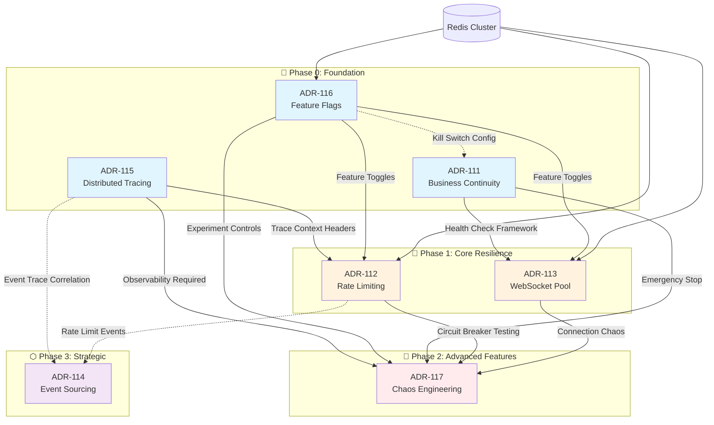

# Batch 4 ADR Integration Blueprint

## Executive Summary

This blueprint defines the integration strategy for seven architectural decisions (ADR-111 through ADR-117) that collectively establish a resilient, observable, and scalable platform. The architecture follows a layered approach where foundational observability and control systems (Tracing, Feature Flags, BCP) must precede operational components (Rate Limiting, WebSocket Pool), which in turn enable advanced resilience validation (Chaos Engineering). Event Sourcing remains a Phase 3 strategic investment. Critical path dependencies include: Tracing must precede Rate Limiting enforcement for observability; Chaos Engineering requires Feature Flags for kill switches and Tracing for safety monitoring; all components integrate with BCP for business continuity guarantees.

---

## 1. Dependency Graph

### 1.1 Visual Dependency Map



### 1.2 Dependency Matrix

| ADR | Depends On | Depended By | Dependency Type |
|-----|------------|-------------|-----------------|
| **ADR-111 BCP** | None | ADR-113, ADR-117 | Hard - Kill switch integration |
| **ADR-115 Tracing** | None | ADR-112, ADR-117, ADR-114 | Hard - Observability prerequisite |
| **ADR-116 Flags** | ADR-111 (soft) | ADR-112, ADR-113, ADR-117 | Hard - Runtime configuration |
| **ADR-112 Rate Limit** | ADR-115, ADR-116 | ADR-117 | Hard - Needs tracing headers |
| **ADR-113 WebSocket** | ADR-111, ADR-116 | ADR-117 | Hard - Health check integration |
| **ADR-117 Chaos** | ADR-111, ADR-115, ADR-116, ADR-112 | None | Hard - All safety systems required |
| **ADR-114 Events** | ADR-115 (soft) | None | Soft - Can be deferred |

### 1.3 Circular Dependencies

**Status:** ✅ No circular dependencies detected.

The dependency graph forms a directed acyclic graph (DAG) with clear layering:
- Foundation layer (0) has no incoming dependencies
- Each subsequent layer only depends on previous layers
- Event Sourcing (Phase 3) has no hard blockers

---

## 2. Implementation Phases

### 2.1 Phase 0: Foundation (Weeks 1-4)

**Go/No-Go Criteria:**
- ✅ All three foundation ADRs implemented and tested
- ✅ Redis cluster operational for shared state
- ✅ Tracing collector receiving spans from all services
- ✅ Feature flag system can toggle features in <100ms
- ✅ BCP runbooks documented and team trained

**Deliverables:**
| ADR | Component | Timeline | Owner |
|-----|-----------|----------|-------|
| ADR-115 | OTel SDK integration, Collector deployment, Jaeger/Zipkin | Week 1-2 | Platform Team |
| ADR-116 | Flag configuration store, Runtime evaluation library, Admin UI | Week 2-3 | Platform Team |
| ADR-111 | Backup automation, Failover runbooks, RTO/RPO testing | Week 3-4 | DevOps Team |

**Integration Points to Establish:**
1. **Tracing + Flags:** All flag evaluation events emit trace spans
2. **Flags + BCP:** Kill switch configuration stored in BCP documentation
3. **Tracing + BCP:** Recovery procedures include trace ID correlation for incident analysis

---

### 2.2 Phase 1: Core Resilience (Weeks 5-8)

**Prerequisites:** Phase 0 complete, all Go/No-Go criteria met

**Go/No-Go Criteria:**
- ✅ Rate limiting enforced on all public APIs with trace correlation
- ✅ WebSocket pool handles 10k+ concurrent connections
- ✅ Graceful shutdown tested and documented
- ✅ Feature flags can disable rate limiting per-client (emergency bypass)

**Deliverables:**
| ADR | Component | Timeline | Owner |
|-----|-----------|----------|-------|
| ADR-112 | Token bucket implementation, Redis counters, Multi-tier quotas | Week 5-6 | API Team |
| ADR-113 | Connection registry, Heartbeat mechanism, Load balancing | Week 6-8 | Real-time Team |

**Integration Points to Establish:**
1. **Rate Limiting + Tracing:** `X-RateLimit-Trace-ID` header propagation
2. **WebSocket + BCP:** Health check endpoint for connection pool status
3. **WebSocket + Flags:** Feature flags for connection limits and heartbeat intervals
4. **Rate Limiting + Flags:** Emergency bypass flags for critical clients

---

### 2.3 Phase 2: Advanced Features - Chaos Engineering (Weeks 9-12)

**Prerequisites:** Phase 1 complete, tracing shows <5% error rate for 7 days

**⚠️ CRITICAL:** Chaos Engineering MUST NOT begin until:
- Kill switch (ADR-111) tested and verified <30s response time
- All chaos experiments behind feature flags (ADR-116)
- Tracing captures 100% of chaos-injected faults (ADR-115)
- On-call team trained on abort procedures

**Go/No-Go Criteria:**
- ✅ Kill switch tested in staging with <30s abort time
- ✅ Automatic abort conditions configured and tested
- ✅ Blast radius controls enforce namespace isolation
- ✅ Chaos experiments run for 48h in staging without incident

**Deliverables:**
| ADR | Component | Timeline | Owner |
|-----|-----------|----------|-------|
| ADR-117 | Chaos Monkey service, Network latency injection, Circuit breaker tests | Week 9-12 | SRE Team |

**Integration Points to Establish:**
1. **Chaos + BCP:** Kill switch API integration (see Section 3)
2. **Chaos + Flags:** Every experiment toggleable via feature flags
3. **Chaos + Tracing:** Chaos spans tagged with experiment ID
4. **Chaos + Rate Limit:** Fault injection tests for circuit breakers
5. **Chaos + WebSocket:** Connection termination chaos tests

---

### 2.4 Phase 3: Strategic - Event Sourcing (Weeks 13-20+)

**Prerequisites:** Phase 2 stable for 30 days, team capacity available

**Go/No-Go Criteria:**
- ✅ Domain identified for event sourcing pilot (recommend: audit log domain)
- ✅ Team trained on event sourcing patterns
- ✅ Event schema versioning strategy defined
- ✅ Projection read model performance requirements defined

**Deliverables:**
| ADR | Component | Timeline | Owner |
|-----|-----------|----------|-------|
| ADR-114 | Event store setup, Event schema registry, Projection builders | Week 13-20+ | Architecture Team |

**Integration Points to Establish:**
1. **Event Sourcing + Tracing:** Correlation between trace IDs and event streams
2. **Event Sourcing + Rate Limit:** Rate limit events stored as domain events

---

## 3. Chaos Engineering Safety Specification

### 3.1 Kill Switch Integration (ADR-111 BCP)

**Architecture:**
```
┌─────────────────┐     ┌──────────────────┐     ┌─────────────────┐
│  Chaos Control  │────▶│  Kill Switch API │────▶│  Chaos Monkey   │
│     Panel       │     │   (ADR-111)      │     │   Service       │
└─────────────────┘     └──────────────────┘     └─────────────────┘
         │                       │                         │
         ▼                       ▼                         ▼
┌─────────────────┐     ┌──────────────────┐     ┌─────────────────┐
│  Feature Flags  │     │  Emergency Stop  │     │  Abort Channel  │
│   (ADR-116)     │     │   (Redis PubSub) │     │  (Immediate)    │
└─────────────────┘     └──────────────────┘     └─────────────────┘
```

**Kill Switch Requirements:**
| Aspect | Specification | Implementation |
|--------|---------------|----------------|
| **Response Time** | <30 seconds from trigger to full stop | Redis PubSub + in-memory flag check |
| **Trigger Methods** | Dashboard button, API call, PagerDuty webhook | Multiple entry points to BCP kill switch API |
| **Propagation** | All chaos agent nodes | PubSub message with 5s heartbeat timeout |
| **Verification** | Chaos agents report "stopped" status | Health check endpoint returns chaos status |
| **Audit Trail** | All kill switch activations logged | Trace span + persistent log entry |

**Kill Switch States:**
- `ARMED` - Chaos experiments ready but not running
- `RUNNING` - Active experiments in progress
- `STOPPING` - Kill switch triggered, agents terminating
- `STOPPED` - All chaos halted, manual reset required
- `LOCKED` - Chaos disabled for maintenance/incident

### 3.2 Feature Flag Controls (ADR-116)

**Experiment Flag Schema:**
```yaml
chaos_experiments:
  pod_termination:
    enabled: false
    scope:
      namespaces: ["staging", "chaos-test"]
      exclude_labels:
        - "critical: true"
    blast_radius:
      max_pods_per_minute: 5
      max_pods_total: 10
    schedule:
      start_time: "09:00"
      end_time: "17:00"
      timezone: "America/Costa_Rica"
    abort_conditions:
      error_rate_threshold: 5.0  # percent
      latency_p99_threshold: 2000  # ms
      
  network_latency:
    enabled: false
    scope:
      services: ["api-gateway", "websocket-service"]
    parameters:
      latency_ms: 100
      jitter_ms: 50
      correlation: 75  # percent of requests affected
```

**Flag Evaluation Flow:**
1. Chaos Monkey queries Feature Flag service before each experiment
2. Flag evaluation includes user segment check (ensures only chaos-enabled environments)
3. If flag disabled mid-experiment, current experiment completes but no new ones start
4. Emergency "all_chaos_disabled" flag overrides all experiment flags

### 3.3 Observability Requirements (ADR-115)

**Required Spans Before Chaos Starts:**

| Span Name | Attributes | Sampling Rate |
|-----------|------------|---------------|
| `chaos.experiment.started` | experiment_id, target_service, blast_radius | 100% |
| `chaos.fault.injected` | fault_type, target_pod, duration | 100% |
| `chaos.experiment.completed` | experiment_id, duration, result | 100% |
| `chaos.abort.triggered` | reason, threshold_breached, automatic | 100% |

**Trace Context Propagation:**
- All chaos-injected faults must carry trace context to measure impact
- Services must propagate `X-Chaos-Experiment-ID` header
- Jaeger queries must be able to filter by experiment ID

**Required Metrics:**
```
chaos_experiments_active_total
chaos_faults_injected_total{fault_type}
chaos_abort_triggers_total{reason}
chaos_kill_switch_activations_total
chaos_blast_radius_pods_affected
```

**Dashboard Requirements:**
- Real-time view of active experiments
- Error rate trend with chaos injection markers
- Latency heatmap with experiment correlation
- Kill switch status and last activation time

### 3.4 Blast Radius Controls

**Namespace Isolation:**
| Environment | Chaos Allowed | Max Blast Radius |
|-------------|---------------|------------------|
| Production | ❌ NO | N/A |
| Staging | ✅ YES | 20% of pods |
| Chaos-Test | ✅ YES | 100% of pods |
| Development | ✅ YES | 100% of pods |

**Pod Selection Rules:**
```yaml
exclusion_selectors:
  labels:
    - "critical: true"           # Never touch critical pods
    - "chaos-monkey: disabled"   # Opt-out label
    - "bypass-kill-switch: true" # Safety: never touch kill switch components
  namespaces:
    - "kube-system"
    - "monitoring"
    - "bcp-kill-switch"
  
inclusion_selectors:
    - "chaos-monkey: enabled"     # Opt-in required for production-like
```

**User Segment Protection:**
- Chaos never affects premium/paying users in staging
- User segment filter: `user.tier != "premium"`
- A/B test cohorts can be excluded from chaos

### 3.5 Automatic Abort Conditions

**Abort Triggers:**
| Condition | Threshold | Action | Cooldown |
|-----------|-----------|--------|----------|
| Error Rate Spike | >5% for 2 minutes | Stop new experiments, complete current | 30 min |
| Latency P99 | >2000ms for 3 minutes | Stop new experiments, complete current | 30 min |
| Error Rate Critical | >10% for 1 minute | Immediate kill switch activation | 60 min |
| Latency Critical | >5000ms for 1 minute | Immediate kill switch activation | 60 min |
| Kill Switch API Unavailable | >30s timeout | Stop all chaos (fail-safe) | Manual reset |
| Feature Flag Service Down | >30s timeout | Stop all chaos (fail-safe) | Manual reset |

**Abort Decision Flow:**
```
Metric Alert ──▶ Chaos Controller ──▶ Evaluate Threshold ──▶ Abort Decision
                                            │
                    ┌───────────────────────┼───────────────────────┐
                    ▼                       ▼                       ▼
              Soft Abort              Hard Abort              Emergency
              (Stop new)              (Complete current)      (Kill switch)
                    │                       │                       │
                    ▼                       ▼                       ▼
              Wait for                  5m grace period         Immediate
              current to end                                    stop
```

---

## 4. Integration Points Matrix

### 4.1 Detailed Integration Mechanisms

| Source ADR | Target ADR | Integration Mechanism | Data Flow |
|------------|------------|----------------------|-----------|
| **ADR-115 Tracing** | **ADR-112 Rate Limit** | HTTP Header Propagation | `X-Trace-ID` and `X-RateLimit-Trace-ID` headers passed through gateway; rate limit decisions emit trace spans with `ratelimit.decision` attribute |
| **ADR-116 Flags** | **ADR-112 Rate Limit** | Runtime Configuration | Flag `rate_limit_emergency_bypass` checked per-request; flag `rate_limit_tier_override` modifies quota calculation |
| **ADR-116 Flags** | **ADR-113 WebSocket** | Runtime Configuration | Flag `websocket_heartbeat_interval` controls ping frequency; flag `websocket_max_connections` sets pool limit |
| **ADR-111 BCP** | **ADR-113 WebSocket** | Health Check Integration | BCP health check endpoint queries WebSocket pool status; graceful shutdown signal triggers connection drain |
| **ADR-111 BCP** | **ADR-117 Chaos** | Kill Switch API | BCP provides `/v1/kill-switch/chaos` endpoint; chaos agents subscribe to Redis PubSub channel `bcp:kill-switch:chaos` |
| **ADR-115 Tracing** | **ADR-117 Chaos** | Span Tagging | All chaos spans tagged with `chaos.experiment_id`, `chaos.fault_type`; fault injection includes trace context propagation |
| **ADR-116 Flags** | **ADR-117 Chaos** | Experiment Control | Each experiment type has dedicated flag; `all_chaos_disabled` master flag; flags support user segmentation for blast radius |
| **ADR-112 Rate Limit** | **ADR-117 Chaos** | Fault Injection Target | Chaos tests circuit breaker by injecting latency into Redis connection; validates token bucket behavior under stress |
| **ADR-113 WebSocket** | **ADR-117 Chaos** | Fault Injection Target | Chaos terminates random WebSocket connections; tests heartbeat detection and reconnection logic |
| **ADR-115 Tracing** | **ADR-114 Events** | Event Correlation | Event store captures trace ID with each event; enables "trace through time" debugging |
| **ADR-112 Rate Limit** | **ADR-114 Events** | Domain Events | Rate limit exceeded events published to event store for audit trail |

### 4.2 Shared Infrastructure

**Redis Cluster Usage:**
| ADR | Redis Purpose | Key Pattern | TTL |
|-----|---------------|-------------|-----|
| ADR-112 | Token bucket counters | `ratelimit:{client_id}:{bucket}` | 1 hour |
| ADR-113 | Connection registry | `ws:conn:{user_id}` | Session duration |
| ADR-116 | Flag cache | `flags:{flag_name}` | 5 minutes |
| ADR-117 | Kill switch state | `chaos:kill-switch` | No TTL |
| ADR-117 | Experiment state | `chaos:experiment:{id}` | Experiment duration |

**Configuration Store:**
- **ADR-116 Feature Flags:** Primary store (YAML/DB) with Redis cache
- **ADR-111 BCP:** Kill switch configuration in BCP documentation + runtime API
- **Shared:** Redis used for runtime state across all ADRs

### 4.3 API Contract Summary

**Cross-ADR Headers:**
| Header | Source | Consumers | Purpose |
|--------|--------|-----------|---------|
| `X-Trace-ID` | ADR-115 | All services | Distributed tracing correlation |
| `X-RateLimit-Limit` | ADR-112 | Clients | Quota information |
| `X-RateLimit-Remaining` | ADR-112 | Clients | Remaining quota |
| `X-RateLimit-Reset` | ADR-112 | Clients | Quota reset time |
| `X-Chaos-Experiment-ID` | ADR-117 | All services | Chaos impact tracking |
| `X-Feature-Flag-Context` | ADR-116 | All services | Flag evaluation context |

---

## 5. Risk Register

### 5.1 ADR-111: Business Continuity Planning

| Rank | Risk | Likelihood | Impact | Mitigation |
|------|------|------------|--------|------------|
| 1 | **Backup corruption** - 3-2-1 backup validation fails | Medium | Critical | Monthly backup restoration drills; checksum verification on all backups |
| 2 | **Runbook outdated** - Procedures don't match reality | High | High | Quarterly runbook review; automated runbook testing in staging |
| 3 | **RTO not achievable** - Recovery takes longer than objective | Medium | Critical | Regular DR drills; pre-staged infrastructure; automated failover scripts |
| 4 | **Single point of failure in kill switch** - BCP kill switch itself fails | Low | Critical | Kill switch deployed in 3 AZs; manual override procedures documented |
| 5 | **Team not trained** - On-call doesn't know procedures | Medium | High | Quarterly BCP training; runbook gamification; incident response drills |

**Rollback Strategy:**
- BCP is procedural; rollback involves reverting to previous runbook version
- Kill switch API: Blue-green deployment with instant rollback

**Testing Requirements:**
- Monthly backup restoration test
- Quarterly full DR drill
- Kill switch tested weekly in staging

### 5.2 ADR-112: API Gateway Rate Limiting

| Rank | Risk | Likelihood | Impact | Mitigation |
|------|------|------------|--------|------------|
| 1 | **Redis unavailable** - Rate limiting fails open or closed | Medium | Critical | Circuit breaker on Redis; local in-memory fallback; fail-open for reads |
| 2 | **Latency overhead** - Redis check adds >50ms latency | Medium | Medium | Redis connection pooling; Lua script for atomic operations; local caching |
| 3 | **False positives** - Legitimate traffic blocked | Medium | High | Burst capacity configuration; client-specific whitelist; emergency bypass flag |
| 4 | **Thundering herd** - All clients retry simultaneously | Medium | High | Exponential backoff in 429 responses; jitter in retry-after header |
| 5 | **Configuration drift** - Limits don't match capacity planning | Medium | Medium | Limits defined in infrastructure-as-code; automated capacity testing |

**Rollback Strategy:**
- Feature flag `rate_limit_disabled` for instant bypass
- Gateway configuration rollback via CI/CD
- Redis data persists but can be flushed if corrupted

**Testing Requirements:**
- Load testing at 2x expected peak traffic
- Redis failure simulation
- Burst traffic pattern testing

### 5.3 ADR-113: WebSocket Connection Pool

| Rank | Risk | Likelihood | Impact | Mitigation |
|------|------|------------|--------|------------|
| 1 | **Memory leak** - Connections not properly cleaned up | Medium | Critical | Strict heartbeat timeout; connection pool limits; memory profiling in staging |
| 2 | **Redis registry out of sync** - User shown as online when offline | Medium | Medium | Heartbeat verification; periodic full-sync; TTL on registry entries |
| 3 | **Uneven load distribution** - One node overloaded | Medium | High | Consistent hashing; connection count-based routing; auto-scaling triggers |
| 4 | **Graceful shutdown failure** - Connections dropped abruptly | Low | High | Drain period configuration; connection migration to other nodes; client retry logic |
| 5 | **Ghost sessions** - Dead connections appear alive | Medium | Medium | Aggressive heartbeat timeout; TCP keepalive; client-side ping verification |

**Rollback Strategy:**
- Connection pool can be restarted without data loss (state in Redis)
- Feature flag to disable WebSocket features
- Sticky session configuration can be reverted at load balancer

**Testing Requirements:**
- 10k concurrent connection soak test
- Node failure during active connections
- Graceful shutdown with active connections

### 5.4 ADR-114: Event Sourcing

| Rank | Risk | Likelihood | Impact | Mitigation |
|------|------|------------|--------|------------|
| 1 | **Event schema evolution** - Breaking changes break replay | High | Critical | Schema registry; backward compatibility enforcement; event versioning strategy |
| 2 | **Projection lag** - Read models stale during high load | Medium | High | Monitoring and alerting on lag; async projection scaling; eventual SLA |
| 3 | **Storage cost explosion** - Event log grows unbounded | Medium | Medium | Snapshot strategy; event archiving; retention policies |
| 4 | **Complexity overhead** - Team struggles with paradigm | High | Medium | Training and documentation; start with simple domain; CQRS not required everywhere |
| 5 | **Replay performance** - Rebuilding state takes too long | Medium | High | Snapshot frequency optimization; parallel replay; read model warming |

**Rollback Strategy:**
- Dual-write period (events + traditional) during migration
- Read models can be rebuilt from events
- Feature flag to use traditional CRUD instead of event sourcing

**Testing Requirements:**
- Event replay correctness verification
- Schema migration testing
- Projection performance under load

### 5.5 ADR-115: Distributed Tracing

| Rank | Risk | Likelihood | Impact | Mitigation |
|------|------|------------|--------|------------|
| 1 | **Sampling too aggressive** - Missing critical traces | Medium | High | Head-based sampling for errors; tail-based sampling for latency outliers |
| 2 | **Storage cost** - Trace volume exceeds budget | Medium | Medium | Sampling configuration; retention policies; trace aggregation |
| 3 | **Context propagation failure** - Broken traces across services | High | Medium | Automated testing for header propagation; middleware verification |
| 4 | **Performance overhead** - Tracing adds >5% latency | Low | Medium | Async span export; batching; pprof profiling |
| 5 | **Vendor lock-in** - Hard to switch from Jaeger/Zipkin | Low | Low | OpenTelemetry standard; avoid vendor-specific SDKs |

**Rollback Strategy:**
- Sampling rate can be reduced to 0% (disable tracing)
- Collector can be bypassed with config change
- No data loss risk (tracing is observability, not functional)

**Testing Requirements:**
- End-to-end trace verification across all services
- Sampling rate validation
- Collector failure resilience

### 5.6 ADR-116: Feature Flag System

| Rank | Risk | Likelihood | Impact | Mitigation |
|------|------|------------|--------|------------|
| 1 | **Flag evaluation latency** - Adds >10ms per request | Medium | High | Local caching; Redis for distributed state; async evaluation |
| 2 | **Configuration error** - Wrong flag state causes incident | High | Critical | Flag change approval workflow; automated testing; gradual rollout only |
| 3 | **Stale cache** - Flag change not reflected immediately | Medium | Medium | Cache TTL tuning; cache invalidation on update; polling fallback |
| 4 | **Flag sprawl** - Too many flags, technical debt | High | Medium | Flag lifecycle policy; automated stale flag detection; cleanup sprints |
| 5 | **Store unavailability** - Flags fail to evaluate | Low | Critical | Local default values; circuit breaker; fail-safe defaults |

**Rollback Strategy:**
- Flag values can be reverted via admin UI (<30s propagation)
- Emergency config file override
- Feature flags can be bypassed in code if critical

**Testing Requirements:**
- Flag evaluation performance test
- Cache invalidation verification
- Fail-safe behavior testing

### 5.7 ADR-117: Chaos Engineering

| Rank | Risk | Likelihood | Impact | Mitigation |
|------|------|------------|--------|------------|
| 1 | **Production impact** - Chaos escapes to production | Low | Critical | Namespace isolation; environment validation; kill switch tested weekly |
| 2 | **Kill switch failure** - Cannot stop chaos when needed | Low | Critical | Multiple kill switch methods; automatic abort conditions; manual procedures |
| 3 | **False confidence** - Chaos tests pass but real incidents fail | Medium | High | Realistic failure scenarios; game days; incident replay chaos tests |
| 4 | **Alert fatigue** - Chaos triggers too many alerts | Medium | Medium | Alert suppression during chaos windows; chaos-aware alerting rules |
| 5 | **Resource waste** - Chaos tests run but don't find issues | Medium | Low | Hypothesis-driven experiments; measure resilience improvement; focused testing |

**Rollback Strategy:**
- Kill switch for immediate stop
- Feature flags to disable specific experiment types
- Chaos agents can be terminated manually

**Testing Requirements:**
- Kill switch response time <30s verified weekly
- Automatic abort conditions tested monthly
- Blast radius controls verified before each experiment

---

## 6. GitHub Issue Updates Needed

### 6.1 Issues Requiring Dependency Information

| Issue | Current Title | Update Required |
|-------|---------------|-----------------|
| #111 | Business Continuity Planning | Add: "Blocks ADR-113, ADR-117. Soft dependency for ADR-116." |
| #112 | API Gateway Rate Limiting | Add: "Depends on ADR-115, ADR-116. Blocks ADR-117 (circuit breaker testing)." |
| #113 | WebSocket Connection Pool | Add: "Depends on ADR-111, ADR-116. Blocks ADR-117 (connection chaos)." |
| #114 | Event Sourcing | Add: "Soft dependency on ADR-115. Phase 3 - can be deferred. No blockers." |
| #115 | Distributed Tracing | Add: "Foundation ADR - blocks ADR-112, ADR-117. Soft dependency for ADR-114." |
| #116 | Feature Flag System | Add: "Depends on ADR-111 (soft). Blocks ADR-112, ADR-113, ADR-117." |
| #117 | Chaos Engineering | Add: "Depends on ADR-111, ADR-115, ADR-116, ADR-112. MUST have kill switch before implementation." |

### 6.2 New Issues to Create

| Issue | Title | Description | Blocked By |
|-------|-------|-------------|------------|
| #118 | Redis Cluster Setup for Batch 4 | Provision Redis cluster for shared state across ADR-112, ADR-113, ADR-116, ADR-117 | None |
| #119 | Kill Switch API Implementation | BCP kill switch service with Redis PubSub | ADR-111 |
| #120 | Chaos Safety Validation Suite | Automated tests for kill switch, abort conditions, blast radius | ADR-117 |
| #121 | Integration Testing: Tracing + Rate Limiting | Verify trace headers propagate through rate limiter | ADR-112, ADR-115 |
| #122 | Integration Testing: Chaos + Circuit Breakers | Validate chaos can test rate limiting circuit breakers | ADR-112, ADR-117 |

### 6.3 Issue Labels to Add

**New Labels:**
- `batch-4-foundation` - Phase 0 ADRs
- `batch-4-resilience` - Phase 1 ADRs
- `batch-4-chaos` - Phase 2 ADRs
- `batch-4-strategic` - Phase 3 ADRs
- `chaos-safety` - Safety-critical for ADR-117
- `integration-blocker` - Blocking other ADRs

**Label Assignments:**
| ADR | Labels |
|-----|--------|
| #111 | `batch-4-foundation`, `chaos-safety` |
| #112 | `batch-4-resilience`, `integration-blocker` |
| #113 | `batch-4-resilience` |
| #114 | `batch-4-strategic` |
| #115 | `batch-4-foundation`, `integration-blocker` |
| #116 | `batch-4-foundation`, `chaos-safety`, `integration-blocker` |
| #117 | `batch-4-chaos`, `chaos-safety` |

---

## 7. Appendix

### 7.1 Glossary

| Term | Definition |
|------|------------|
| **BCP** | Business Continuity Planning |
| **RTO** | Recovery Time Objective - max acceptable downtime |
| **RPO** | Recovery Point Objective - max acceptable data loss |
| **OTel** | OpenTelemetry - distributed tracing standard |
| **CQRS** | Command Query Responsibility Segregation |
| **Kill Switch** | Emergency stop mechanism for chaos experiments |
| **Blast Radius** | Scope of impact for a chaos experiment |
| **Token Bucket** | Rate limiting algorithm allowing bursts |

### 7.2 Decision Log

| Date | Decision | Rationale |
|------|----------|-----------|
| 2026-04-13 | Event Sourcing deferred to Phase 3 | Strategic complexity, no hard dependencies |
| 2026-04-13 | Tracing precedes Rate Limiting | Observability required for enforcement decisions |
| 2026-04-13 | Chaos requires 4 dependencies | Safety requires kill switch, flags, tracing, and rate limiting |
| 2026-04-13 | Redis as shared state store | Consistent with existing architecture, proven at scale |

### 7.3 Review Schedule

| Review Type | Frequency | Participants |
|-------------|-----------|--------------|
| Phase Go/No-Go | Per phase | Architecture, Platform, SRE leads |
| Chaos Safety Audit | Weekly during Phase 2 | SRE, Security |
| Integration Testing | Per integration point | Feature teams |
| Full Blueprint Review | Monthly | All stakeholders |

---

*Blueprint Version: 1.0*  
*Created: 2026-04-13*  
*Author: Hugrukal 📐 - Software Architect*  
*Status: Ready for Implementation Review*
