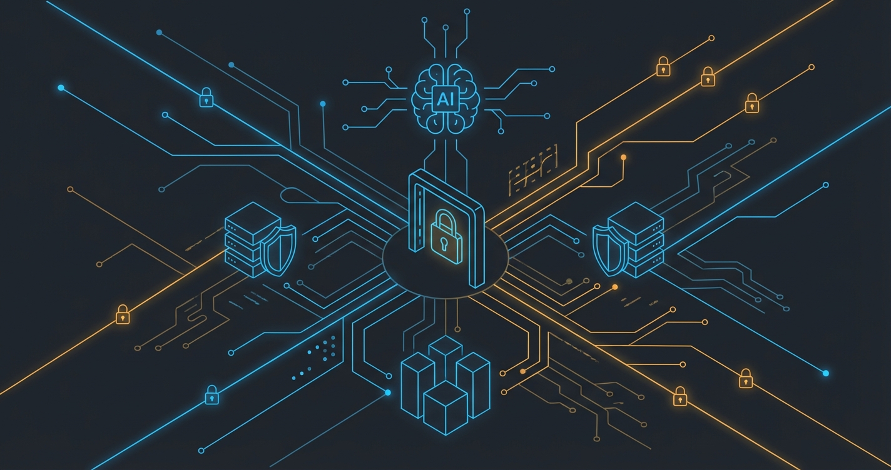
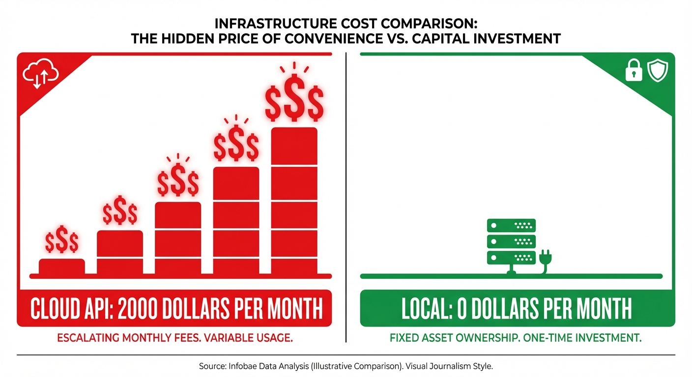

# Zero-Trust AI Infrastructure: Building a $0/Month Local LLM Cluster

**Published:** April 13, 2026  
**Author:** Andler  
**Reading Time:** 15 minutes  
**Tags:** #AIInfrastructure #ZeroTrust #DevOps #LLM #StartupEngineering



---

## The Story

Six months ago, I was staring at our cloud LLM bill and doing the math. At our current growth rate, we'd be burning $2,000-3,000/month on API credits within a year. For a lean startup, that's not just a line item—that's a runway killer.

But here's the real problem: every prompt we sent to the cloud contained proprietary data. Agent conversations, code snippets, business logic. All of it stored on someone else's servers. I don't know about you, but that kept me up at night.

So I made a decision: we're going local. No cloud APIs. No recurring costs. No data leaving our perimeter.

The challenge? We needed 24/7 access for automated agents, secure remote access for the team, and enterprise-grade security—all on a startup budget.

This is how we built it. And yes, you can too.

---

## What You'll Learn

By the end of this guide, you'll know:
- How to set up Zero-Trust networking (no open ports, ever)
- How to route traffic intelligently (remote vs. local)
- How to build a high-availability cluster with automatic failover
- How to keep models resident in VRAM (no cold starts)
- How to queue agent requests without crashing your server
- **Total monthly cost:** $0 (after one-time hardware)

**Prerequisites:**
- Basic Linux/terminal knowledge
- Two machines (can be old laptops, Raspberry Pis, or repurposed hardware)
- One GPU-enabled machine (for primary inference)
- ~4 hours of focused time

Let's build.

---

## Phase 1: Zero-Trust Networking

**Goal:** Make your AI infrastructure invisible to the public internet.

**The Problem:** Traditional VPNs require open ports. Port scanners find them. Attackers exploit them.

**The Solution:** Identity-bound mesh networking. No open ports. Ever.

### Step 1.1: Install Tailscale

On every machine (primary, secondary, and your laptop):

```bash
curl -fsSL https://tailscale.com/install.sh | sh
```

### Step 1.2: Authenticate with Identity Provider

Don't use shared secrets. Tie access to your workspace identity:

```bash
sudo tailscale up --login-server=https://login.microsoftonline.com
```

Or for Google Workspace:

```bash
sudo tailscale up --login-server=https://accounts.google.com
```

**Why this matters:** When someone leaves your team, you revoke their workspace access. They lose network access automatically. No hunting for SSH keys or VPN passwords.

### Step 1.3: Enable MagicDNS

In your Tailscale admin console, enable MagicDNS. This gives each machine a stable hostname like `ai-primary.tailnet-name.ts.net`.

**Key Learning #1:** Your perimeter is now identity-based, not port-based. Scanners see nothing. Attackers can't reach you. But your team can access from anywhere, as if they're on the same WiFi.

---

## Phase 2: Intelligent Routing

**Goal:** Route traffic based on where it comes from (remote vs. local) without breaking real-time streaming.

**The Problem:** Reverse proxies buffer responses by default. This breaks Server-Sent Events (SSE)—the protocol that LLM token streaming depends on.

**The Solution:** Nginx with buffering disabled, dual-path architecture.

### Step 2.1: Install Nginx

On your primary node:

```bash
sudo apt update && sudo apt install nginx -y
```

### Step 2.2: Configure Dual-Path Routing

Create `/etc/nginx/sites-available/ai-cluster`:

```nginx
# Remote access (encrypted, via Tailscale)
server {
    listen 443 ssl;
    server_name ai-primary.tailnet-name.ts.net;
    
    # Auto-provisioned certificates via Tailscale
    ssl_certificate /etc/ssl/certs/tailscale.crt;
    ssl_certificate_key /etc/ssl/private/tailscale.key;
    
    location / {
        proxy_pass http://localhost:11434;
        proxy_buffering off;  # CRITICAL: enables SSE streaming
        proxy_cache off;      # Disable all caching
        chunked_transfer_encoding on;
    }
}

# Local access (direct, low latency)
server {
    listen 80;
    server_name ai-primary.local;
    
    location / {
        proxy_pass http://localhost:11434;
        proxy_buffering off;
        proxy_cache off;
        chunked_transfer_encoding on;
    }
}
```

Enable the site:

```bash
sudo ln -s /etc/nginx/sites-available/ai-cluster /etc/nginx/sites-enabled/
sudo nginx -t && sudo systemctl reload nginx
```

**Key Learning #2:** `proxy_buffering off` is not optional. Without it, your streaming UI will wait for the entire response before showing anything. With it, tokens stream in real-time. Test it: `curl -N https://your-tailscale-host/v1/chat/completions` and watch tokens arrive one by one.

---

## Phase 3: High-Availability Cluster

**Goal:** Zero downtime, even when primary node conserves resources.

**The Problem:** GPU machines consume power. Sometimes you want to spin them down. But automated agents can't tolerate downtime.

**The Solution:** Nginx upstream with automatic failover.

### Step 3.1: Configure Upstream

Update your Nginx config:

```nginx
upstream ollama_cluster {
    server 192.168.1.100:11434 weight=3;  # Primary (GPU)
    server 192.168.1.101:11434 backup;    # Secondary (always-on)
}

server {
    listen 443 ssl;
    # ... SSL config ...
    
    location / {
        proxy_pass http://ollama_cluster;
        proxy_buffering off;
        proxy_connect_timeout 5s;
        proxy_read_timeout 300s;  # Extended for long-running inference
    }
}
```

### Step 3.2: Test Failover

Spin down your primary node. Watch Nginx automatically route to secondary:

```bash
# On primary node
sudo systemctl stop ollama

# From client (should still work)
curl http://nginx-host/v1/models
```

**Key Learning #3:** The `backup` directive means "only use this when primary is down." No complex orchestration. No Kubernetes. Just Nginx doing what it's done for 20 years.

---

## Phase 4: Hardware-Aware Queuing

**Goal:** Handle multiple agent requests without crashing or timeouts.

**The Problem:** Multiple agents query simultaneously. VRAM fills up. Requests queue. Clients timeout. Server crashes trying to force concurrency.

**The Solution:** Patient queuing + resident models.

### Step 4.1: Keep Models Resident

Set environment variable before starting Ollama:

```bash
export OLLAMA_KEEP_ALIVE=-1
ollama serve
```

This keeps models loaded in VRAM indefinitely. No cold starts. No load-time penalties.

### Step 4.2: Extend Agent Timeouts

In your agent code (example in Python):

```python
import requests

response = requests.post(
    'http://nginx-host/v1/chat/completions',
    json={'model': 'llama3', 'messages': [...]},
    timeout=300  # 5 minutes - let it queue patiently
)
```

**Why 300 seconds?** If the queue has 3 agents ahead of you, and each takes 60 seconds, you'll wait 3 minutes. Better to wait than crash.

### Step 4.3: Monitor VRAM Usage

Watch what's loaded:

```bash
watch -n1 'nvidia-smi'
```

If models are unloading unexpectedly, increase `OLLAMA_KEEP_ALIVE` or reduce concurrent model count.

**Key Learning #4:** Sequential processing with patient clients beats forced concurrency. Your agents should wait, not crash. Stability over speed.

---

## Phase 5: Defense-in-Depth

**Goal:** No single point of failure. No bypass routes.

**The Problem:** Even with Nginx routing, local devices might try to access Ollama directly—bypassing rate limits and authentication.

**The Solution:** Firewall rules that enforce the routing layer.

### Step 5.1: Configure UFW

On your primary node:

```bash
sudo ufw default deny incoming
sudo ufw allow from 192.168.1.0/24 to any port 22  # SSH from local network
sudo ufw allow from 100.64.0.0/10 to any port 443  # Tailscale subnet
sudo ufw allow from 127.0.0.1 to any port 11434    # Ollama from localhost only
sudo ufw enable
```

### Step 5.2: Verify

From another machine on your network:

```bash
nmap -p 11434 ai-primary.local
# Should show: 11434/tcp filtered
```

**Key Learning #5:** Layered security. If Nginx is misconfigured, UFW catches it. If UFW has a gap, Tailscale's identity-bound access still protects you.

---

## The Results



| Metric               | Cloud API Approach                    | Our Local Infrastructure  |
| -------------------- | ------------------------------------- | ------------------------- |
| **Recurring Costs**  | $500-2000/month (scales with usage)   | $0 (one-time hardware)    |
| **Data Sovereignty** | Prompts stored on third-party servers | 100% within our perimeter |
| **Security Posture** | Exposed API endpoints                 | Zero inbound ports        |
| **Uptime**           | Dependent on provider                 | Self-managed failover     |
| **Latency**          | Network round-trip + queue            | Local network only        |

**What we achieved:**
- ✅ Enterprise-grade security on a startup budget
- ✅ Zero recurring third-party LLM API costs
- ✅ 100% data sovereignty
- ✅ Operational resilience with zero downtime
- ✅ Secure remote access from anywhere

---

## The Hard Parts (Honest Talk)

This isn't all sunshine. Here's what you're signing up for:

**1. Sequential Bottlenecks**
Your agents will queue. If you have 10 agents hitting the LLM simultaneously, the last one might wait 10 minutes. Mitigation: design agents for patience, not speed.

**2. Manual Resource Management**
I physically walk to the GPU machine and press the power button when I want to conserve resources. Yes, I could automate this with IPMI or smart plugs. No, I haven't gotten around to it yet. It's on the list.

**3. You Own the Breakage**
When the API goes down, you can't file a support ticket. You debug it. That's the price of control.

But here's the thing: I sleep better knowing our data never leaves our perimeter. I sleep better knowing our infrastructure costs are $0/month. And when cloud APIs have outages? We keep humming.

---

## Key Learnings

After building this, here's what I'd tell my past self:

**1. Start with Zero-Trust networking**
Don't bolt it on later. Identity-bound access from day one means you can't accidentally expose something. It's harder to retrofit security than to build it in.

**2. Patient queuing beats forced concurrency**
I tried to make agents run in parallel. The server crashed. VRAM thrashed. Models loaded and unloaded constantly. Sequential processing with extended timeouts? Rock solid.

**3. Test failover before you need it**
Spin down your primary node on a Tuesday afternoon. See what breaks. Fix it. Don't learn about gaps at 2 AM on a Saturday.

**4. Documentation is your future friend**
Write down your architecture while it's fresh. Six months from now, you'll thank yourself when you've forgotten why you made each decision.

---

## Next Steps

This guide gets you to a working, production-ready system. But there's more to explore:

**Coming in future posts:**
- Monitoring and alerting setup (Prometheus + Grafana)
- Automated power management (IPMI integration)
- Performance benchmarks (tokens/sec, concurrent users)
- Cost breakdown (hardware TCO vs. cloud 3-year projection)
- Model selection guide (which models for which workloads)

**Want to go deeper?**
- Tailscale docs: https://tailscale.com/kb/
- Nginx streaming config: https://nginx.org/en/docs/http/ngx_http_proxy_module.html#proxy_buffering
- Ollama environment variables: https://github.com/ollama/ollama/blob/main/docs/faq.md

---

## Let's Talk

If you're building similar infrastructure, I'd love to hear about it. What worked? What didn't? What would you do differently?

Reach out: [contact@andler.dev](mailto:contact@andler.dev)

And if this guide saved you from cloud API costs, pay it forward. Share what you learn. Build in public. The community grows when we all grow.

---

**About the Author:** Andler is a CTO and entrepreneur building AI-driven startups. He believes in lean infrastructure, data sovereignty, and clever engineering over big budgets. When he's not debugging Nginx configs, he's probably teaching his kids to code or hunting for the perfect coffee blend.

---

*This post is part of a series on lean startup infrastructure. Subscribe for future updates.*
